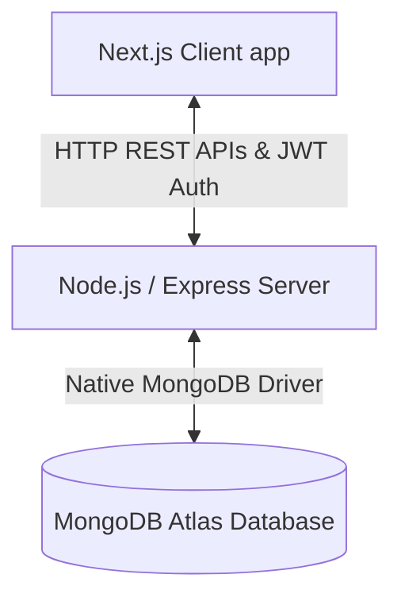
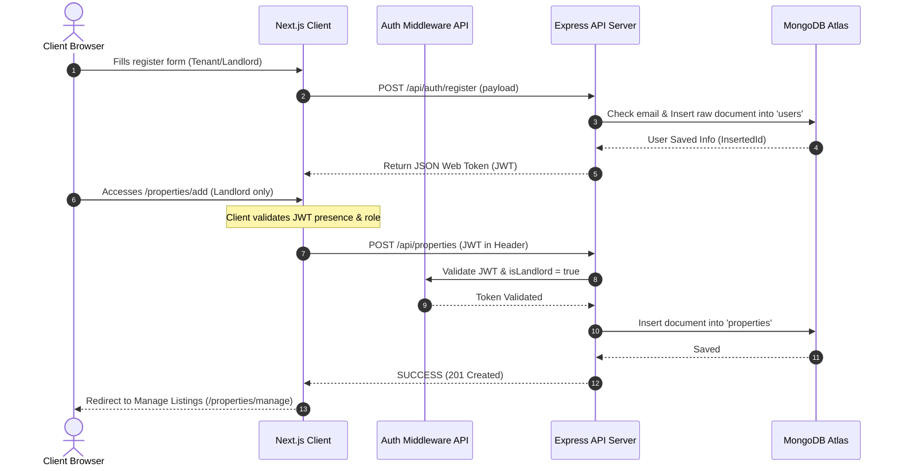

# NextKey — Architecture Document

## 1. App Flow and Architecture

NextKey utilizes a decoupled Client-Server architecture. The frontend application represents the client workspace, and the backend service acts as the controller and database layer, communicating via RESTful APIs.

### Architecture Overview



### Application Flow & Security



1.  **Authentication Flow:** Token-based authentication using **jsonwebtoken (JWT)**. On successful login or registration, the server issues a signed JWT. The client stores this token (`localStorage` or secure cookie) and attaches it in the `Authorization: Bearer <token>` HTTP header of all requests. Validation is performed on the server via route-specific middleware.
2.  **Database Connection:** The backend uses the native `mongodb` Node.js driver to connect directly to MongoDB Atlas. Connection persistence is handled via a single MongoClient singleton to avoid exhaustively recreation of connections.
3.  **Listing Fetching Flow:** Property catalog searches, filters, sorting, and pagination parameters are passed as URL queries from the client, parsed by the server controllers, converted into MongoDB aggregation queries or projection options, and retrieved directly from Atlas.
4.  **Rental & Review Flow:** Tenants submit rental requests and reviews when logged in. The database tracks relations via storing references (e.g. `landlordId`, `tenantId`, `propertyId`) as raw `ObjectId` properties.

---

## 2. Tech Stack

The workspace is split into two root-level directories containing their respective modules inside the `/Rent Nest` directory:

### Frontend Client (`/client`)
*   **Framework:** Next.js (App Router) with TypeScript.
*   **Routing:** Dynamic folder-based routing structure using explicit routes under Next.js 13/14+ App Router structure.
*   **Styling:** Tailwind CSS (configured with 3 primary colors and 1 neutral color).
*   **Data Visualization:** Recharts (rendering metrics on Property Management).
*   **Utility Libraries:** Axios (for API requests), React Icons.

### Backend Server (`/server`)
*   **Environment:** Node.js with TypeScript (`tsx` / `ts-node`).
*   **Framework:** Express.js.
*   **Database Client:** Native MongoDB Node Driver (`mongodb`).
*   **Authentication & Hashing:** JWT (`jsonwebtoken`), `bcrypt.js`.
*   **CORS:** Enabled specifically for client port communication.

---

## 3. Folder and File Structure

Below is the directory design representing the client-server structure under the main directory, utilizing Next.js App Router configurations.

```text
Rent Nest/
├── client/                     # Frontend Client Application (Next.js App Router)
│   ├── public/                 # Static assets (logos, offline icons)
│   ├── src/
│   │   ├── app/                # Explicit App Router Routing
│   │   │   ├── layout.tsx      # Root HTML shell viewport layout
│   │   │   ├── page.tsx        # Homepage (9 sections: Featured, Categories, FAQs, testimo, etc.)
│   │   │   ├── login/
│   │   │   │   └── page.tsx    # Dedicated /login route (Auth forms, demo user/admin toggles)
│   │   │   ├── register/
│   │   │   │   └── page.tsx    # Dedicated /register route (Role selection)
│   │   │   ├── about/
│   │   │   │   └── page.tsx    # Dedicated /about route
│   │   │   ├── contact/
│   │   │   │   └── page.tsx    # Dedicated /contact route
│   │   │   ├── properties/
│   │   │   │   ├── page.tsx    # Dedicated /properties route (Explore Listings + Search + Sort + Filters)
│   │   │   │   ├── [id]/
│   │   │   │   │   └── page.tsx# Dynamic details route /properties/:id (Specs, Gallery, Reviews)
│   │   │   │   ├── add/
│   │   │   │   │   └── page.tsx# Protected route /properties/add (Landlords listing entry form)
│   │   │   │   └── manage/
│   │   │   │       └── page.tsx# Protected route /properties/manage (Landlord listings, Recharts, Delete)
│   │   │   └── my-requests/
│   │   │       └── page.tsx    # Dedicated /my-requests route (Tenant requests status log)
│   │   ├── components/         # Reusable presentation modular layouts
│   │   │   ├── ui/             # Reusable UI widgets: buttons, inputs, modal, skeleton loader
│   │   │   ├── Navbar.tsx      # Sticky responsive navigation bar (Adaptive user layout links)
│   │   │   └── Footer.tsx      # Footer with quick-links and credentials contacts
│   │   ├── context/
│   │   │   └── AuthContext.tsx # Context managing active payload user role logins
│   │   └── styles/
│   │       └── globals.css     # Tailwind Base configuration styling imports
│   ├── tailwind.config.ts      # Tailwind design system options colors setup
│   ├── tsconfig.json
│   └── package.json
│
├── server/                     # Backend Server Application (Node/Express)
│   ├── src/
│   │   ├── config/
│   │   │   └── db.ts           # Native MongoClient singleton initializer for Atlas
│   │   ├── controllers/        # Controllers querying DB collections directly
│   │   │   ├── authController.ts
│   │   │   ├── propertyController.ts
│   │   │   ├── rentalController.ts
│   │   │   └── reviewController.ts
│   │   ├── middleware/         # Middleware checks jwt headers and properties
│   │   │   ├── authMiddleware.ts
│   │   │   └── roleMiddleware.ts
│   │   ├── types/              # Type Declarations for raw MongoDB document mapping
│   │   │   └── database.ts     # User & Property Interfaces matching raw driver schema
│   │   ├── routes/             # Routers coordinating base controllers routes actions
│   │   │   ├── authRoutes.ts
│   │   │   ├── propertyRoutes.ts
│   │   │   ├── rentalRoutes.ts
│   │   │   └── reviewRoutes.ts
│   │   ├── app.ts              # Express core configurations setup
│   │   └── index.ts            # Dynamic Server start module listener
│   ├── tsconfig.json
│   └── package.json
│
├── prd.md                      # Product Requirements Document
├── architecture.md             # System Flow and Infrastructure Details
└── README.md                   # Main instructions
```
