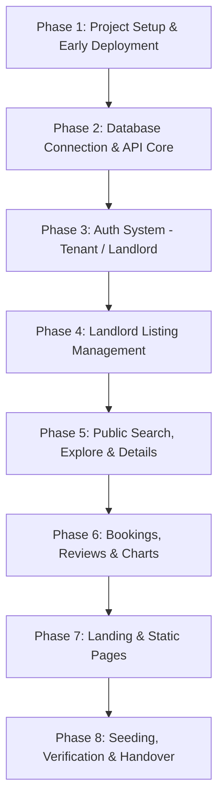

# NextKey — Project Phases

This document details the step-by-step roadmap for building and deploying NextKey. An "early deployment" approach is used to sync the client to Vercel and the backend to Render immediately, ensuring environment and deployment configurations are resolved before writing core features.

---

---

## Phase 1: Project Setup & Early Deployment (The Skeleton)
*   **Init Workspace:** Create directory layout `/client` (using Next.js App Router default TypeScript boilerplate) and `/server` (Node/Express with TypeScript, `tsconfig.json`, and dependencies).
*   **Establish Repository:** Initialize local Git, commit directories, and push to a remote GitHub repository.
*   **Deploy Backend Server:** Deploy a basic "Hello World" or `/api/health` Express route onto **Render**. Set CORS settings to allow client port requests.
*   **Deploy Client UI:** Deploy the boilerplate template directory onto **Vercel**. Set client environment configurations (e.g., `NEXT_PUBLIC_API_URL` pointing to the Render endpoint URL).
*   **Verify Deployment:** Execute verification checking that the Vercel client can access Render's health endpoint successfully.

---

## Phase 2: Database Connection & API Core
*   **Configure MongoDB Atlas:** Spin up an Atlas Shared Project Cluster, whitelist access IPs, and acquire the database connection URI.
*   **Create Client Singleton:** Create `/server/src/config/db.ts` to establish and maintain a single MongoClient instance to connect.
*   **Write Server Boot configurations:** Express middleware parsing (`express.json()`), logging, error routing middleware, and environment setups using `.env` files.
*   **Define Collection helpers:** Setup clean schemas / interfaces helpers inside code logic (`/server/src/types/database.ts`).

---

## Phase 3: Auth System (Tenant / Landlord)
*   **Backend Auth Controllers:** Write register controller (validating if name, email exist) and login controller (encrypting/matching passwords using `bcryptjs` and generating `jsonwebtoken` tokens containing user id and roles configurations).
*   **Router & Middlwares:** Establish base routes `/api/auth/register`, `/api/auth/login`, and `/api/auth/me`. Build `authMiddleware.ts` validating token headers.
*   **Frontend UI pages:** Build `/register` (with selection input choosing Tenant vs Landlord) and `/login` (with Tenant and Landlord pre-fill demo buttons).
*   **Client State Provider:** Establish `AuthContext.tsx` storing active JWT tokens, managing active login state, and routing users on login.

---

## Phase 4: Landlord Listing Management (Protected)
*   **Define Property Collection Schemes:** Construct Property interfaces (referencing landlord's User ID).
*   **Express Routes Protection:** Integrate express middleware ensuring requests require valid tokens and elevated roles (`isLandlord === true`).
*   **API Implementations:** Write `POST /api/properties` (Insert One listing document info) and `DELETE /api/properties/:id` (Delete One owned document listing).
*   **Frontend Landlord Pages:** 
    *   Create `/properties/add` (Property listing fields input form layout).
    *   Create `/properties/manage` (Table list showing owned listings with direct Delete action triggers).

---

## Phase 5: Public Search, Explore & Details
*   **Catalog Fetch Router Backend:** Write `GET /api/properties` with parse logic handling search strings, price range limits, filters (types, bedroom count), pagination parameters, and sort flags. Write `GET /api/properties/:id`.
*   **Core Listing Cards:** Build the uniform styling Listing Card component (desktop layout displaying 4 items per row, loading skeleton indicators).
*   **Explore Page `/properties`:** Hook up search options, filter fields, sort selections, pagination controls, and cards.
*   **Dynamic Listings Details Page `/properties/[id]`:** Layout specifications gallery, features checklist, and related options panels.

---

## Phase 6: Bookings, Reviews & Charts
*   **Rent Requests Flow:** Build routes `POST /api/rentals` (for Tenant creation) and `GET /api/rentals/mine` (to feed Tenant's `/my-requests` interface).
*   **Reviews & Ratings:** Build endpoints to submit and load comments per property. Incorporate reviews into `/properties/[id]`.
*   **Landlord Recharts Integration:** Integrate analytics bar charts within `/properties/manage` rendering aggregate metrics (e.g., listings distributed by pricing categories using active listings coordinates).

---

## Phase 7: Landing & Static Pages
*   **Responsive Sticky Navbar & Footer:** Implement sticky position styling navbar displaying conditional links adapted to tenant configuration statuses (logged out vs logged in states). Write footer contacts.
*   **Homepage Construction:** Combine all 9 sections under `/app/page.tsx` (Hero slider, category options grids, testimonials, stats counter banner, FAQs accordions).
*   **Static Pages Layouts:** Complete components for `/about` and `/contact` (handling simple message forms input validation logic).

---

## Phase 8: Seeding, Verification & Handover
*   **Write MongoDB Seeding Script:** Create a simple script `/server/src/scripts/seed.ts` inserting test collections users (demol landlord, tenant), property listings, rental requests, and reviews directly.
*   **Test Responsive Layouts:** Verify design states adapt correctly context-wise across target mobile, tablet, and desktop screens.
*   **Verification Sync Deploy:** Deploy current repository commits onto Vercel and Render, verify production configuration endpoints operate in synchronization, and populate database profiles.
*   **Assemble Final Readme:** Wrap instructions detailing dependencies startups parameters, testing, credentials logs, and endpoint links.
